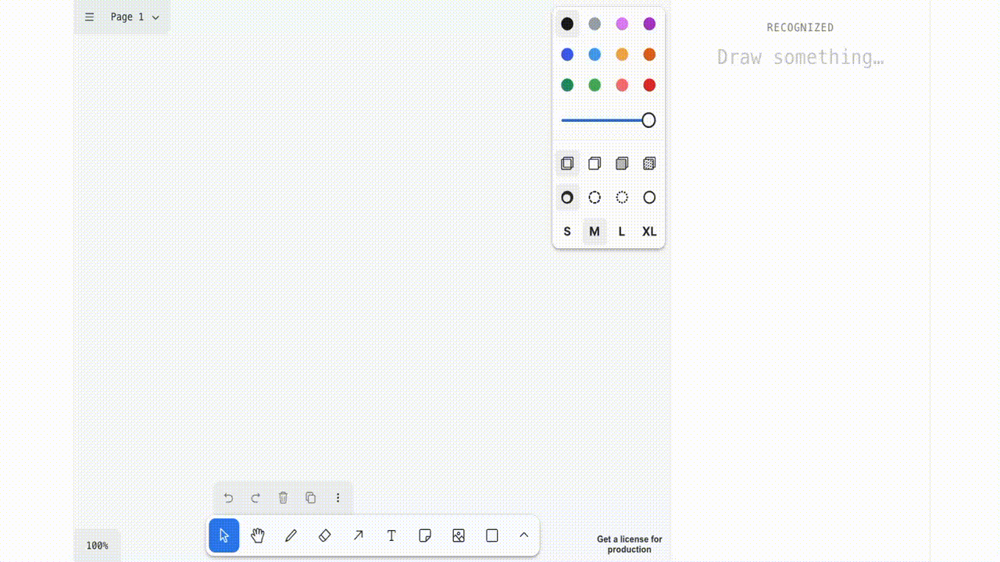

# Web OCR Demo

Este código es ilustrativo de la latencia que se puede conseguir en local ejecutando modelos de OCR. Hay una página para etiquetar datos en `data-capture`, es el típico React con Vite que te da cualquier LLM, lo puedes lanzar con `npm run dev`. Una vez guardados los datos, en `training` hay un script muy sencillito para entrenar un modelo también sencillito. Típico script de python, te creas un entorno virtual (venv) con los paquetes y lo lanzas. El entrenamiento te dirá qué clases tienen mejor o peor validación por si quieres añadir más datos a esa clase. Inicialmente incluí el asterisco `*` pero era imposible que no se confundiera con el signo más `+` y la `x`. En los datos etiqueté 266 muestras, la mayor parte son porque mi caligrafía es muy mala y hago la `x` y la `y` de mil maneras. Esto es solo una prueba de concepto. Con un modelo preentrenado seguramente necesites menos. Una vez entrenado lo pasas a onnx y después lo cuantizas. Con el modelo listo lanzas la aplicación que está en `frontend` y podrás probar tú mismo.

Workflow:

```
---- Terminal 1
cd data-capture
npm run dev -- --port 8007

----- Terminal 2
cd frontend
npm run dev -- --port 8008

----- Terminal 3
cd training
uv run train.py
uv run export_onnx.py
uv run quantize.py
```

El modelo está pensado para ejecutarse en WebAssembly por lo que solo funcionará en Chrome. En mi ordenador (MacBook Pro M1 64GB RAM) la latencia del modelo son unos 7ms y el consumo en memoria está por debajo de 1GB así que no lo puedo medir bien del todo.

